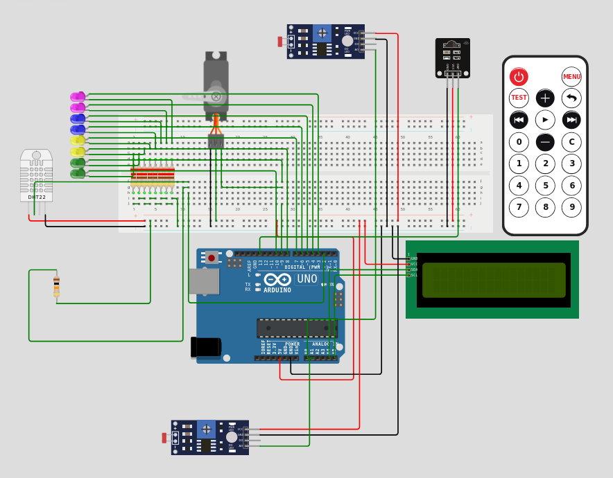

# Sistemas de medición, control, actuación y presentación del clima utilizando técnicas de comunicaciones, avanzadas y/o inteligentes

## Introducción

En esta actividad se parte del trabajo desarrollado en la [Actividad 2](https://github.com/ignacio-gr/eie_act2.git), que consistía en el diseño e implementación de un sistema de medición y actuación ambiental con sensores y actuadores integrados a una placa Arduino.

El sistema permitía controlar de forma automática variables como la temperatura, humedad e iluminación, mostrando sus resultados.

En esta segunda parte, se busca perfeccionar el sistema original mediante la incorporación de mejoras funcionales, centradas en la supervisión inteligente, el control remoto y el autodiagnóstico, haciendo especial énfasis en la experiencia del usuario a través de una interfaz HMI local.

## Objetivo

Mejorar el sistema de control climático desarrollado en la actividad anterior, incorporando:

- Control remoto
- Autodiagnóstico
- Supervisión inteligente
- Interfaz HMI más funcional

Todo esto con el fin de aumentar su precisión, autonomía y facilidad de uso.

## Descripción del sistema

- **Control remoto:** a través de un mando a distancia que permite encender o apagar el sistema (ON/OFF).  
  Además, permite controlar el umbral de activación del sistema de iluminación, modificando los niveles de luz deseados sin necesidad de alterar el código fuente.

- **Comunicación remota simulada:** mediante una interfaz serial, que simula una comunicación IP para el monitoreo en tiempo real. Este sistema podría integrarse en el futuro a soluciones basadas en IoT.

- **Autodiagnóstico:**
  -  *Monitoreo de humedad*: con activación de alarmas en caso de detectar valores fuera del rango esperado.
  -  *Verificación de iluminación*: utiliza dos sensores de luz, realizando una comparación cruzada para validar la lectura.
  -  *Modo prueba*: permite validar el funcionamiento completo del sistema mediante la manipulación de LEDs y servomotor, asegurando que todos los componentes respondan correctamente.

---

## Resultados y análisis

Gracias a las mejoras incorporadas, el sistema ahora cuenta con una mayor versatilidad:

- Permite modificar parámetros de control de forma dinámica.
- Facilita la supervisión del estado ambiental de manera local y remota.
- Detecta errores o fallos de lectura gracias al sistema de autodiagnóstico.
- Aumenta la confiabilidad gracias al uso de sensores redundantes.

Estas mejoras transforman el proyecto de la actividad anterior en un **prototipo funcional** de un sistema inteligente aplicable, por ejemplo, en entornos de domótica.

---

## Conclusiones

La implementación de sistemas de control inteligente y supervisión remota ha permitido perfeccionar el proyecto inicial, dotándolo de mayor autonomía y capacidad de diagnóstico.

Este tipo de sistemas son clave en aplicaciones modernas donde la eficiencia energética y el control ambiental son fundamentales.

## Links
- https://wokwi.com/projects/434551352164042753

